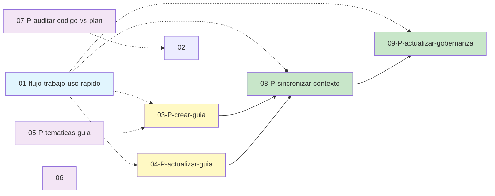

# stage-management-system/prompts/guias/ — Índice del Directorio

> **Propósito:** Índice completo y guía de navegación para todos los archivos del directorio de prompts de guías del sistema de gestión de stages.
> **Última actualización:** 2026-06-12

---

## Índice de Contenido

- [1. Descripción del Directorio](#1-descripcion-del-directorio)
- [2. Estructura del Directorio](#2-estructura-del-directorio)
- [3. Tabla de Archivos](#3-tabla-de-archivos)
  - [3.1. Documento de Inicio](#31-documento-de-inicio)
  - [3.2. Prompts Principales](#32-prompts-principales)
  - [3.3. Prompts de Sincronización](#33-prompts-de-sincronización)
  - [3.4. Prompts Transversales](#34-prompts-transversales)
  - [3.5. Referencia y Ejemplos](#35-referencia-y-ejemplos)
- [4. Dependencias Entre Archivos](#4-dependencias-entre-archivos)
- [5. Orden de Lectura Recomendado](#5-orden-de-lectura-recomendado)
- [6. Cómo Usar Este Directorio](#6-como-usar-este-directorio)

---

<a id="1-descripcion-del-directorio"></a>
## 1. Descripción del Directorio

Este directorio contiene los prompts, guías de flujo y documentación de soporte para el **Sistema de Guías Automatizadas**, un conjunto de herramientas que permiten crear, actualizar, auditar y sincronizar guías técnicas para agentes IA sobre cualquier área del proyecto.

| Aspecto | Detalle |
|---------|---------|
| **Ruta** | `stage-management-system/prompts/guias/` |
| **Propósito** | Centralizar todos los prompts relacionados con la gestión de guías técnicas |
| **Total archivos** | 11 |
| **Subdirectorios** | Ninguno |

---

<a id="2-estructura-del-directorio"></a>
## 2. Estructura del Directorio

```
stage-management-system/prompts/guias/
├── 00_INDICE.md                                        <- ESTE ARCHIVO
├── 01-flujo-trabajo-uso-rapido.md                      <- Mapa visual + contenido ampliado
├── 03-P-crear-guia.md                                  <- Crear guía técnica
├── 04-P-actualizar-guia.md                             <- Actualizar guía existente
├── 05-P-tematicas-guia.md                              <- Inventario de áreas a documentar
├── 06-P-auditar-directorio.md                          <- Auditoría de directorio
├── 07-P-auditar-codigo-vs-plan.md                      <- Auditoría código vs plan
├── 08-P-sincronizar-contexto.md                        <- Sincronizar .opencode/context/
├── 09-P-actualizar-gobernanza.md                       <- Sincronizar .gobernanza/
├── ejemplos-uso-prompts.md                             <- Ejemplos prácticos de uso
└── estado-prompts.md                                   <- Reporte técnico del sistema
```

---

<a id="3-tabla-de-archivos"></a>
## 3. Tabla de Archivos

<a id="31-documento-de-inicio"></a>
### 3.1. Documento de Inicio

| # | Nombre | Ruta relativa | Finalidad | Dependencias | Resumen |
|:-:|--------|---------------|-----------|--------------|---------|
| 1 | `01-flujo-trabajo-uso-rapido.md` | `stage-management-system/prompts/guias/01-flujo-trabajo-uso-rapido.md` | Mapa visual del flujo de trabajo completo + contenido ampliado (arquitectura, estructura de guías, notas) | Ninguna (documento de inicio del sistema) | Explica el proceso: desarrollo → 03/04 (guía) → 08/09 (sincronizar). Incluye 6 diagramas Mermaid, tabla de referencia rápida, estructura detallada de los 3 documentos de guía, reglas y notas importantes. |

> **Nota:** El antiguo `01-recapitulacion-sistema-guias.md` fue eliminado. Su contenido útil (objetivo del sistema, estructura de guías) está migrado al `01-flujo-trabajo-uso-rapido.md` (sección «Contenido ampliado») y a `estado-prompts.md` (sección «Arquitectura»).

<a id="32-prompts-principales"></a>
### 3.2. Prompts Principales

| # | Nombre | Ruta relativa | Finalidad | Dependencias | Resumen |
|:-:|--------|---------------|-----------|--------------|---------|
| 3 | `03-P-crear-guia.md` | `stage-management-system/prompts/guias/03-P-crear-guia.md` | Crear guía técnica completa desde cero para un área nueva del proyecto | Ninguna (autónomo) | 4 fases: explore + ContextScout + CodeReviewer investigan, OpenAgent sintetiza y decide perfil (doc2/doc3), TechnicalWriter redacta 3 documentos, CodeReviewer + ContextOrganizer + BuildAgent revisan. Incluye TaskManager opcional. |
| 4 | `04-P-actualizar-guia.md` | `stage-management-system/prompts/guias/04-P-actualizar-guia.md` | Actualizar guía técnica existente tras cambios en la funcionalidad | Guía existente en `conocimiento-guias-ia/` | Fase 0 de diagnóstico + 4 fases: explore + ContextScout + CodeReviewer + ContextRetriever investigan cambios, OpenAgent clasifica, TechnicalWriter actualiza solo secciones afectadas, CodeReviewer + ContextOrganizer + BuildAgent revisan. |

<a id="33-prompts-de-sincronización"></a>
### 3.3. Prompts de Sincronización

| # | Nombre | Ruta relativa | Finalidad | Dependencias | Resumen |
|:-:|--------|---------------|-----------|--------------|---------|
| 8 | `08-P-sincronizar-contexto.md` | `stage-management-system/prompts/guias/08-P-sincronizar-contexto.md` | Sincronizar `.opencode/context/` con la información de una guía recién creada o actualizada | 03 o 04 ejecutados previamente | CodeReviewer extrae conceptos de la guía, ContextScout descubre estado actual, sincroniza vía comandos `/context extract`, `/context organize`, `/context validate`. |
| 9 | `09-P-actualizar-gobernanza.md` | `stage-management-system/prompts/guias/09-P-actualizar-gobernanza.md` | Sincronizar `.gobernanza/` (inventario, navigation) con los recursos detectados en una guía recién creada o actualizada | 08 ejecutado previamente | CodeReviewer extrae recursos (variables, endpoints, componentes, contratos), ContextScout descubre estado actual, propone cambios al usuario (R3), aplica solo tras aprobación, valida contra schema (R4). |

<a id="34-prompts-transversales"></a>
### 3.4. Prompts Transversales

| # | Nombre | Ruta relativa | Finalidad | Dependencias | Resumen |
|:-:|--------|---------------|-----------|--------------|---------|
| 5 | `05-P-tematicas-guia.md` | `stage-management-system/prompts/guias/05-P-tematicas-guia.md` | Detectar áreas del proyecto candidatas a documentar | Ninguna (autónomo) | explore mapea estructura, ContextScout descubre guías existentes, CodeReviewer analiza áreas en paralelo, genera `inventario-areas.md` con prioridades y entradas listas para P-crear-guia. Soporta modo incremental. |
| 6 | `06-P-auditar-directorio.md` | `stage-management-system/prompts/guias/06-P-auditar-directorio.md` | Auditar un directorio completo contra el código actual | Ninguna (autónomo) | explore lista archivos, ContextScout busca referencias cruzadas, CodeReviewer verifica 7 puntos (vigencia, paths, discrepancias, duplicación, recomendación, inventario, estándares). BuildAgent opcional. Genera informe en `auditoria/`. |
| 7 | `07-P-auditar-codigo-vs-plan.md` | `stage-management-system/prompts/guias/07-P-auditar-codigo-vs-plan.md` | Auditar código contra un plan de diseño (Modo A) o contra la definición del proyecto (Modo B) | Ninguna (autónomo) | explore mapea área, ContextScout + ContextRetriever descubren contexto, CodeReviewer analiza código y extrae plan, clasifica hallazgos por tipo (OMIT, EXC, DISC-B, DISC-E, DISC-C, DISC-S, DISC-I, INT, DEAD, STD) y gravedad. TechnicalWriter genera informe. CodeReviewer revisa. |

<a id="35-referencia-y-ejemplos"></a>
### 3.5. Referencia y Ejemplos

| # | Nombre | Ruta relativa | Finalidad | Dependencias | Resumen |
|:-:|--------|---------------|-----------|--------------|---------|
| — | `ejemplos-uso-prompts.md` | `stage-management-system/prompts/guias/ejemplos-uso-prompts.md` | Referencia rápida con ejemplos prácticos de cómo ejecutar cada prompt | Todos los prompts (los ejemplos los referencian) | Muestra entrada de usuario para cada prompt con ejemplos actualizados (03, 04, 07, 08, 09). Incluye tabla resumen de todos los campos de entrada (obligatorios y opcionales). |
| — | `estado-prompts.md` | `stage-management-system/prompts/guias/estado-prompts.md` | Reporte técnico del estado actual de todos los prompts tras las mejoras aplicadas | Ninguna (documentación interna) | Tablas de estado, mejoras transversales, subagentes por prompt, tamaños de archivo, notas. Incluye la arquitectura del sistema de guías migrada desde el antiguo 01. |

---

<a id="4-dependencias-entre-archivos"></a>
## 4. Dependencias Entre Archivos



**Nota sobre las flechas:**
- **Flecha sólida (-->):** Dependencia secuencial obligatoria (ej: 08 necesita que 03/04 se haya ejecutado antes).
- **Flecha punteada (-.->):** Referencia o sugerencia, no obligatoria (ej: 01 se consulta para entender el sistema, 05 genera entradas para 03).
- **Archivos 05, 06, 07** son autónomos y no dependen de otros prompts para funcionar.

---

<a id="5-orden-de-lectura-recomendado"></a>
## 5. Orden de Lectura Recomendado

| Paso | Archivo | Por qué leerlo |
|:----:|---------|---------------|
| 1° | `01-flujo-trabajo-uso-rapido.md` | Entender el flujo completo del sistema: cuándo usar cada prompt, en qué orden, y qué resultado obtienes |
| 2° | `03-P-crear-guia.md` | Prompt principal para crear guías nuevas |
| 3° | `04-P-actualizar-guia.md` | Prompt principal para actualizar guías existentes |
| 4° | `08-P-sincronizar-contexto.md` | Prompt para sincronizar contexto tras crear/actualizar una guía |
| 5° | `09-P-actualizar-gobernanza.md` | Prompt para sincronizar gobernanza tras sincronizar contexto |
| 6° | `05-P-tematicas-guia.md` | Para detectar qué áreas del proyecto necesitan documentación |
| 7° | `06-P-auditar-directorio.md` | Para auditar directorios antes de limpiar o reestructurar |
| 8° | `07-P-auditar-codigo-vs-plan.md` | Para verificar que el código sigue el diseño especificado |
| 9° | `ejemplos-uso-prompts.md` | Ejemplos prácticos de cómo usar cada prompt |

---

<a id="6-como-usar-este-directorio"></a>
## 6. Cómo Usar Este Directorio

### Para ejecutar un prompt

1. Abre el archivo `.md` del prompt que necesites (ej: `03-P-crear-guia.md`).
2. Copia el bloque entre `--- INICIO DEL PROMPT ---` y `--- FIN DEL PROMPT ---`.
3. Pégalo como primer mensaje al agente IA (OpenAgent, OpenCode, etc.).
4. Añade la entrada del usuario según los campos obligatorios y opcionales indicados.

### Para entender el sistema

1. Empieza por `01-flujo-trabajo-uso-rapido.md` (visión general con diagramas).
2. Sigue el orden de lectura recomendado.

### Para el flujo principal (obligatorio tras cada desarrollo)

```
Desarrollo nuevo → 03-P-crear-guia
                                → 08-P-sincronizar-contexto → 09-P-actualizar-gobernanza
Mejora existente → 04-P-actualizar-guia
```

### Para auditar o diagnosticar

Usa `06-P-auditar-directorio.md` para verificar el estado de cualquier directorio del proyecto, o `07-P-auditar-codigo-vs-plan.md` para contrastar implementación contra diseño.

### Para mantener el inventario de áreas

Ejecuta `05-P-tematicas-guia.md` periódicamente para detectar nuevas áreas que necesiten documentación. Usa el modo `incremental` para escanear solo lo nuevo.
