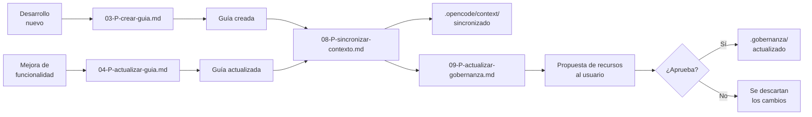
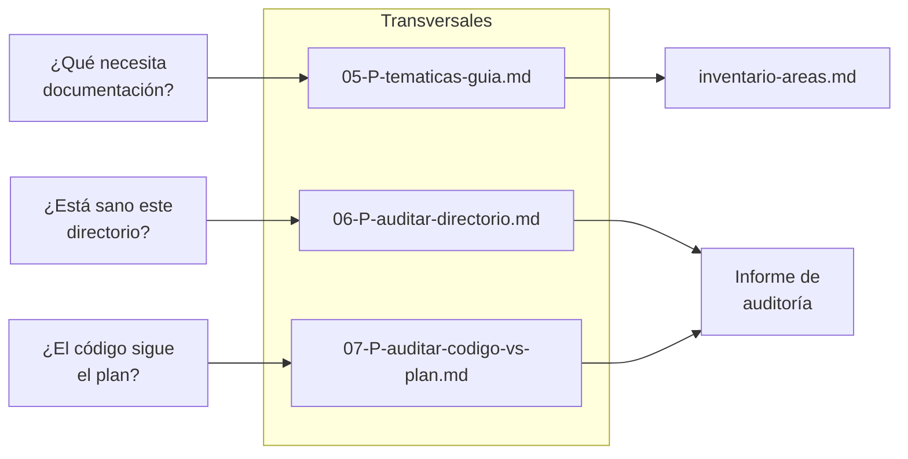
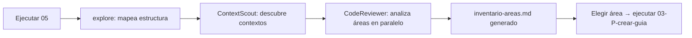
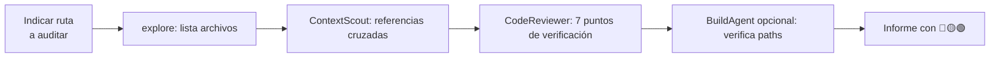
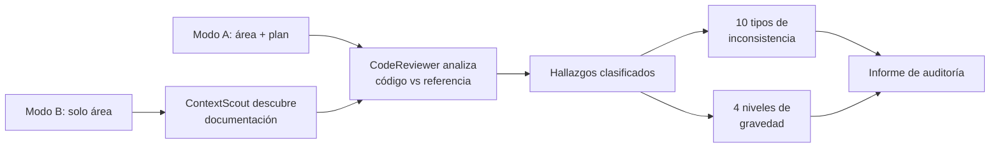
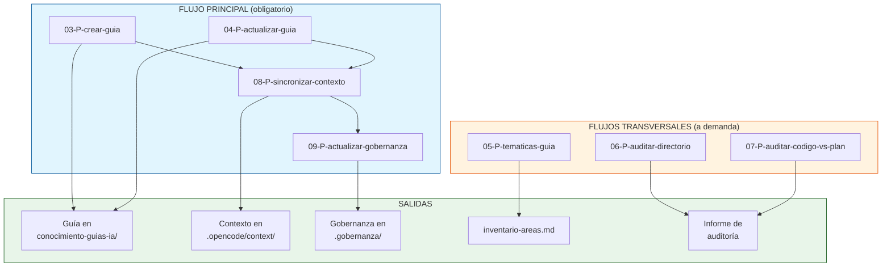

# Flujo de trabajo — Sistema de Guías

> **Propósito:** Explicar el proceso completo de documentación del proyecto: cómo y cuándo usar cada uno de los prompts del sistema de guías.
> **Última actualización:** 2026-06-12

---

## Índice

1. [Guía rápida: flujos de trabajo](#1-guía-rápida-flujos-de-trabajo)
   - [Flujo principal (obligatorio)](#flujo-principal--obligatorio-tras-cada-desarrollo)
   - [Flujos transversales (a demanda)](#flujos-transversales--opcionales-cuando-se-necesiten)
   - [Mapa completo del sistema](#mapa-completo-del-sistema)
   - [Referencia rápida](#referencia-rápida)
2. [Contenido ampliado](#2-contenido-ampliado)
   - [¿Qué es el Sistema de Guías?](#qué-es-el-sistema-de-guías)
   - [Estructura detallada de una guía (3 documentos)](#estructura-detallada-de-una-guía-3-documentos)
   - [Reglas de los 3 documentos](#reglas-de-los-3-documentos)
   - [Ubicación de las guías](#ubicación-de-las-guías)
   - [Notas importantes](#notas-importantes)

---

# 1. Guía rápida: flujos de trabajo

<a id="flujo-principal--obligatorio-tras-cada-desarrollo"></a>
## Flujo principal — Obligatorio tras cada desarrollo

Cuando completas una funcionalidad nueva o modificas una existente, este es el camino a seguir:



### Paso a paso

| Paso | Cuándo | Qué hace | Resultado |
|:----:|--------|----------|-----------|
| **1** | Cuando terminas una **funcionalidad nueva** | Ejecutar `03-P-crear-guia.md` | Crea los 3 documentos de guía desde cero |
| **o** | Cuando **modificas/mejoras** una existente | Ejecutar `04-P-actualizar-guia.md` | Actualiza solo las secciones que cambiaron |
| **2** | Inmediatamente después del paso 1 | Ejecutar `08-P-sincronizar-contexto.md` | Extrae los conceptos de la guía a `.opencode/context/` vía comandos `/context` |
| **3** | Inmediatamente después del paso 2 | Ejecutar `09-P-actualizar-gobernanza.md` | Detecta nuevos recursos, te los propone para aprobar, y actualiza `.gobernanza/` |

---

<a id="flujos-transversales--opcionales-cuando-se-necesiten"></a>
## Flujos transversales — Opcionales, cuando se necesiten

Estos prompts no forman parte del flujo principal. Se ejecutan **a demanda** según la necesidad:



### 05 — P-tematicas-guia



| Cuándo usarlo | Qué consigues |
|---------------|---------------|
| Al inicio del proyecto (inventario inicial) | Lista completa de áreas candidatas con prioridad |
| Al añadir funcionalidades grandes | Áreas nuevas detectadas automáticamente |
| Periódicamente (mantenimiento) | Áreas desactualizadas identificadas |

### 06 — P-auditar-directorio



| Cuándo usarlo | Qué consigues |
|---------------|---------------|
| Antes de limpiar un directorio | Paths rotos, duplicaciones, info obsoleta |
| Antes de reestructurar | Diagnóstico completo del contenido |
| Para verificar consistencia | Discrepancias contra el código actual |

### 07 — P-auditar-codigo-vs-plan



| Cuándo usarlo | Modo | Qué consigues |
|---------------|:----:|---------------|
| Al terminar una implementación | A (plan concreto) | Verificación contra la especificación |
| Antes de desplegar | A o B | Detección de desviaciones críticas |
| Al detectar bugs recurrentes | B | Inconsistencias con estándares del proyecto |
| Antes de una refactorización | A o B | Línea base de desviaciones a corregir |

---

<a id="mapa-completo-del-sistema"></a>
## Mapa completo del sistema



---

<a id="referencia-rápida"></a>
## Referencia rápida

| Prompt | Cuándo | Entrada | Salida | Duración |
|--------|--------|---------|--------|:--------:|
| **03** Crear guía | Desarrollo nuevo | Descripción del área | 3 docs en `conocimiento-guias-ia/` | Alta |
| **04** Actualizar guía | Mejora de funcionalidad | Área + cambios realizados | 3 docs actualizados | Media |
| **05** Temáticas | Inventario inicial o periódico | *(opcional: scope)* | `inventario-areas.md` | Alta (1ª vez) |
| **06** Auditar directorio | Antes de limpiar/reestructurar | Ruta del directorio | Informe en `auditoria/` | Baja/Media |
| **07** Auditar código vs plan | Al terminar implementación | Área + plan (o solo área) | Informe en `auditoria/` | Alta |
| **08** Sincronizar contexto | Tras 03 o 04 | Ruta de la guía | `.opencode/context/` actualizado | Media |
| **09** Actualizar gobernanza | Tras 08 | Ruta de la guía | `.gobernanza/` actualizado | Media |

### Campos opcionales comunes

| Campo | Aplica a | Valores |
|-------|:--------:|---------|
| `Writer override` | 03, 04, 07 | `DocWriter` \| `TechnicalWriter` |
| `Complejidad` | 03, 04 | `normal` \| `alta` |
| `Skip BuildAgent` | 04, 06 | `true` \| `false` |
| `Skip validate` | 08 | `true` \| `false` |
| `Tipo de guía` | 08, 09 | `creada` \| `actualizada` |

---

# 2. Contenido ampliado

<a id="qué-es-el-sistema-de-guías"></a>
## ¿Qué es el Sistema de Guías?

Un conjunto de prompts que automatizan la creación, actualización y auditoría de **guías técnicas** para que cualquier agente IA (OpenAgent, OpenCode) pueda entender, usar y modificar cualquier área del proyecto sin necesidad de contexto previo.

**Objetivo:** Que un agente IA pueda:

- Entender qué es y para qué sirve cada parte del proyecto
- Conocer sus elementos, componentes y artefactos
- Comprender dependencias internas y externas
- Saber cómo crearlo, usarlo, configurarlo y ejecutarlo
- Evitar errores conocidos (no corregirlos, **evitarlos**)

Sin necesidad de tener contexto previo sobre esa parte del sistema.

**Cuándo se usa:** Al finalizar el desarrollo de una nueva función o al modificar/mejorar una existente, aprovechando el conocimiento fresco.

---

<a id="estructura-detallada-de-una-guía-3-documentos"></a>
## Estructura detallada de una guía (3 documentos)

Cada guía se compone de 3 documentos con **referencias cruzadas obligatorias** para evitar duplicación y versiones descoordinadas.

| Documento | Tamaño | Propósito | Contenido | Público |
|-----------|:------:|-----------|-----------|---------|
| **01-ficha-rapida.md** | Máx. 100 líneas | Visión general para decidir si leer los otros docs | Qué es, para qué sirve, dónde está en el proyecto, archivos clave, dependencias principales | IA que necesita contexto rápido |
| **02-arquitectura.md** | — | Explicar cómo funciona, no cómo se usa | Diagramas Mermaid, flujos, ciclos de vida, relaciones entre componentes, árboles de dependencia | IA que va a modificar o extender la funcionalidad |
| **03-referencia-operativa.md** | — | Explicar cómo se usa, no cómo funciona | Configuración, creación, comandos, ejemplos de código, troubleshooting, errores conocidos | IA que va a operar o configurar la funcionalidad |

---

<a id="reglas-de-los-3-documentos"></a>
## Reglas de los 3 documentos

- Cada doc referencia explícitamente a los otros 2 cuando un tema se solapa
- No repetir explicaciones entre docs
- Si un contenido es relevante para más de un doc, se pone en uno y se referencia desde los otros

### Decisión doc2 vs doc3

Automática, basada en la naturaleza del código:

- **Predominan relaciones entre componentes** (muchas clases conectadas, herencia, interfaces) → más peso en **doc2 (arquitectura)**
- **Predominan configuraciones y comandos** (variables de entorno, endpoints, ejemplos) → más peso en **doc3 (operativa)**
- **Equilibrado** → mismo nivel de detalle en ambos

---

<a id="ubicación-de-las-guías"></a>
## Ubicación de las guías

```
stage-management-system/conocimiento-guias-ia/
├── [area-descriptiva]/
│   ├── 01-ficha-rapida.md
│   ├── 02-arquitectura.md
│   └── 03-referencia-operativa.md
└── ...
```

Los nombres `01`, `02`, `03` son fijos para todas las áreas. El subdirectorio `[area-descriptiva]` varía según la parte del proyecto documentada (ej: `workflow-engine`, `auth-system`, `forms-api`).

---

<a id="notas-importantes"></a>
## Notas importantes

- **El orden importa:** 03/04 → 08 → 09 es secuencial. No ejecutes 08 sin haber ejecutado 03/04 antes.
- **09 requiere aprobación (R3):** El prompt `09-P-actualizar-gobernanza.md` se detiene y te presenta una propuesta de nuevos recursos para el inventario. Debes aprobarlos explícitamente antes de que se apliquen. Esto es obligatorio por las reglas del proyecto (regla R3: aprobación previa de nombres).
- **05, 06, 07 son independientes:** Puedes ejecutarlos en cualquier momento, no dependen del flujo principal.
- **Sin prisa:** Los prompts están diseñados para ser exhaustivos. La primera ejecución de 05 puede tomar tiempo porque escanea todo el proyecto. Las siguientes son incrementales.
- **Escritor por defecto:** Los prompts 03, 04 y 07 usan **TechnicalWriter** como escritor primario porque el contenido es mayoritariamente técnico y el público principal es IA (80%). Puedes forzar **DocWriter** con el campo opcional `Writer override` si prefieres un enfoque más narrativo.
- **Sincronización de contexto:** `08-P-sincronizar-contexto.md` usa los comandos `/context` nativos de OpenAgentControl (no `task()` directo) para extraer, organizar y validar los contextos en `.opencode/context/`. No requiere subagentes adicionales.
- **Validación de gobernanza:** Cada modificación a `.gobernanza/inventario_recursos.yaml` se valida automáticamente contra su schema (`.gobernanza/schemas/inventario_recursos.schema.json`).
