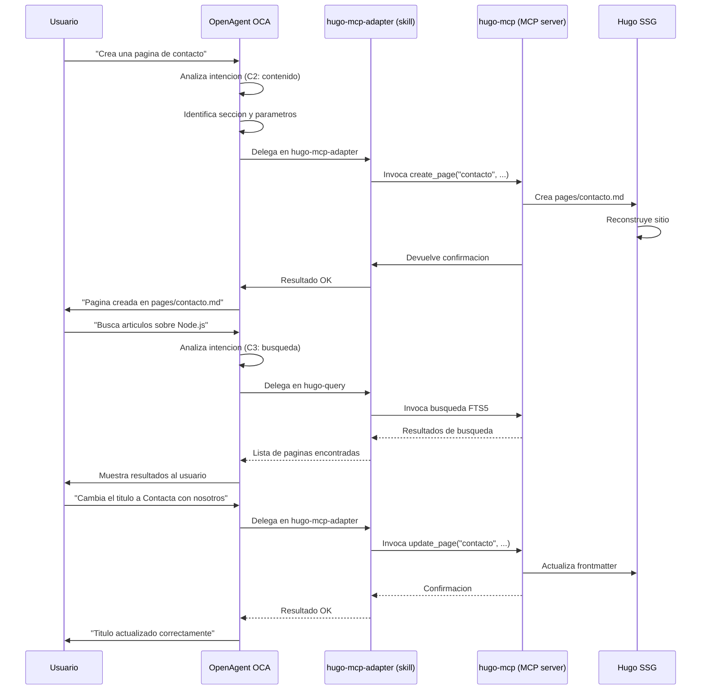

# Gestion de contenido con OCA

**Proposito**: Guia para crear, editar, buscar y eliminar contenido Hugo mediante lenguaje natural con OCA. OCA interpreta la intencion del usuario y delega en skills y MCPs para operar sobre el contenido del sitio.

**Fecha**: 2026-06-16

**Aplica a**: REPON (proyecto clonado de REPOC) con proyecto Hugo ya creado

**Prerrequisito**: Proyecto Hugo creado segun [guia de creacion de proyectos](02_crear-proyecto.md).

---

## Indice

- [1. Crear una pagina](#1-crear-una-pagina)
- [2. Listar paginas existentes](#2-listar-paginas-existentes)
- [3. Editar una pagina](#3-editar-una-pagina)
- [4. Eliminar una pagina](#4-eliminar-una-pagina)
- [5. Subir imagenes](#5-subir-imagenes)
- [6. Tipos de contenido](#6-tipos-de-contenido)
- [7. Busqueda de contenido](#7-busqueda-de-contenido)
- [8. Ejemplo completo](#8-ejemplo-completo)
- [9. Diagrama Mermaid](#9-diagrama-mermaid)
- [Ver tambien](#ver-tambien)

---

## 1. Crear una pagina

Para crear una pagina nueva, di a OCA en lenguaje natural:

> "Crea una pagina de contacto"
> "Anade un articulo sobre Node.js"
> "Crea una pagina acerca-de con informacion del equipo"

OCA utiliza el skill `hugo-mcp-adapter` que invoca `hugo-mcp` (MCP server de jmrGrav). El flujo es:

1. OCA interpreta el tipo de contenido y la seccion.
2. Si falta informacion, OCA pregunta: titulo, seccion, contenido opcional.
3. OCA delega en el subagente HugoMCPSpecialist.
4. El subagente invoca `create_page` de hugo-mcp con los parametros.
5. hugo-mcp crea el fichero `.md`, reconstruye el sitio y purga Cloudflare.
6. OCA confirma al usuario que la pagina se creo correctamente.

Ejemplo de peticion completa:

```
Usuario: "Crea una pagina de contacto con formulario"
OCA:     "En que seccion? (default: pages)"
Usuario: "En pages"
OCA:     "Cual es el titulo? (default: Contacto)"
Usuario: "Contacto"
OCA:     "Pagina 'contacto' creada en pages/contacto.md"
```

---

## 2. Listar paginas existentes

Para ver el contenido actual del sitio:

> "Que paginas tengo?"
> "Enumera los articulos de la seccion blog"
> "Lista todas las paginas"

OCA invoca `list_pages` de hugo-mcp y presenta el resultado en formato legible:

```
Paginas encontradas:
- pages/contacto.md (Contacto)
- pages/acerca-de.md (Acerca de)
- blog/articulo-nodejs.md (Introduccion a Node.js)
- blog/articulo-hugo.md (Primeros pasos con Hugo)
```

Puedes filtrar por seccion anadiendo el nombre:

> "Que paginas tengo en la seccion blog?"

---

## 3. Editar una pagina

Para modificar contenido existente:

> "Cambia el titulo de la pagina de contacto a 'Contacta con nosotros'"
> "Actualiza el contenido de la pagina de inicio"
> "Anade un parrafo sobre instalacion al articulo de Node.js"

OCA invoca `update_page` de hugo-mcp. Segun la peticion, puede actualizar:

| Accion | Que modifica | Ejemplo |
|--------|-------------|---------|
| Cambiar titulo | `frontmatter.title` | `"Cambia el titulo de X a Y"` |
| Actualizar contenido | Cuerpo del Markdown | `"Anade un parrafo sobre X a Y"` |
| Modificar frontmatter | Campos de metadatos | `"Cambia la fecha a 2026-07-01"` |
| Anadir tags | `frontmatter.tags` | `"Anade la tag tutorial a la pagina X"` |

Para editar el contenido directamente, OCA puede leer el fichero actual, aplicar los cambios solicitados y escribir la nueva version.

---

## 4. Eliminar una pagina

Para borrar una pagina existente:

> "Borra la pagina de contacto"
> "Elimina el articulo sobre Node.js"

OCA invoca `delete_page` de hugo-mcp. Antes de ejecutar, OCA confirma la accion:

```
OCA: "Vas a eliminar la pagina 'contacto' en pages/contacto.md. Confirmas? (si/no)"
```

Al confirmar, hugo-mcp elimina el fichero, reconstruye el sitio y purga Cloudflare.

---

## 5. Subir imagenes

Para anadir imagenes al sitio:

> "Sube esta imagen a /images/logo"
> "Pon una foto en /images/equipo"

OCA utiliza `upload_asset` de hugo-mcp. El flujo es:

1. OCA solicita la ruta del fichero local.
2. OCA pregunta el destino dentro de `static/`.
3. hugo-mcp copia el fichero a `static/<destino>`.
4. OCA confirma la ubicacion final.

Las imagenes subidas quedan accesibles en la URL `<baseURL>/<destino>`.

---

## 6. Tipos de contenido

Hugo organiza el contenido en secciones (directorios dentro de `content/`). Los mas comunes:

| Tipo | Directorio | Uso |
|------|-----------|-----|
| Pagina | `content/pages/` | Paginas independientes (contacto, acerca-de) |
| Post | `content/blog/` | Articulos del blog ordenados por fecha |
| Seccion | `content/<seccion>/` | Cualquier agrupacion personalizada |

### Frontmatter

Cada pagina Hugo incluye metadatos en la cabecera (frontmatter). OCA los gestiona automaticamente.

Campos comunes del frontmatter:

| Campo | Tipo | Obligatorio | Descripcion |
|-------|------|-------------|-------------|
| `title` | string | Si | Titulo de la pagina |
| `date` | fecha | Si | Fecha de publicacion (ISO 8601) |
| `draft` | boolean | No | Si es true, no se publica en produccion |
| `tags` | array | No | Lista de etiquetas |
| `categories` | array | No | Lista de categorias |
| `description` | string | No | Resumen para SEO y listados |
| `weight` | numero | No | Orden en listados (menor = primero) |

Ejemplo de frontmatter generado por OCA:

```yaml
---
title: "Introduccion a Node.js"
date: 2026-06-16
draft: false
tags:
  - nodejs
  - javascript
  - tutorial
categories:
  - desarrollo
description: "Guia basica de Node.js para principiantes"
---
```

---

## 7. Busqueda de contenido

Para buscar contenido existente:

> "Busca articulos sobre Node.js"
> "Encuentra contenido relacionado con Hugo"
> "Que tags tiene la pagina de contacto?"

OCA utiliza el skill `hugo-query`, que envuelve `hugo-memex` (MCP server de queelius). hugo-memex indexa el contenido en SQLite con FTS5 (Full-Text Search) y permite:

- Busqueda de texto completo sobre todo el contenido.
- Sugerencia de tags basada en el indice de contenido.
- Validacion de contenido (completitud, referencias cruzadas).
- Listado de paginas por seccion, tag o fecha.

Para busquedas avanzadas o auditoria de calidad, consulta la documentacion de los skills de auditoria en `.opencode/skills/`.

---

## 8. Ejemplo completo

Caso practico: crear un blog post desde cero.

**Paso 1**: El usuario dice:

> "Crea un articulo del blog sobre como empezar con Hugo"

**Paso 2**: OCA pregunta detalles:

```
OCA: "Cual es el titulo?" (default: "Como empezar con Hugo")
Usuario: "Guia completa de Hugo para principiantes"
OCA: "Que tags quieres incluir? (separadas por coma)"
Usuario: "hugo, ssg, tutorial"
OCA: "Quieres anadir contenido ahora o dejarlo en blanco?"
Usuario: "Anade este contenido: Hugo es un generador de sitios estaticos..."
```

**Paso 3**: OCA genera el fichero `content/blog/guia-completa-hugo.md`:

```yaml
---
title: "Guia completa de Hugo para principiantes"
date: 2026-06-16
draft: false
tags:
  - hugo
  - ssg
  - tutorial
categories:
  - desarrollo-web
description: "Guia paso a paso para empezar con Hugo, el generador de sitios estaticos mas rapido."
---
```

```markdown
Hugo es un generador de sitios estaticos escrito en Go...

## Que es Hugo

Hugo es conocido por su velocidad y flexibilidad...

## Instalacion

Para instalar Hugo, visita [gohugo.io](https://gohugo.io)...
```

**Paso 4**: OCA confirma:

```
OCA: "Pagina creada en content/blog/guia-completa-hugo.md"
```

**Paso 5**: Para ver el resultado, di:

> "Arranca el servidor de desarrollo"

El articulo aparecera en `http://localhost:1313/blog/guia-completa-hugo/`.

---

## 9. Diagrama Mermaid

Flujo completo de una peticion de gestion de contenido:



Cada peticion del usuario sigue este patron:

1. El usuario expresa la intencion en lenguaje natural.
2. OCA analiza la peticion y selecciona la capacidad (C2, C3, etc.).
3. OCA delega en el skill correspondiente.
4. El skill invoca el MCP server adecuado.
5. El MCP opera sobre Hugo (crea, lee, actualiza o elimina ficheros).
6. OCA verifica el resultado y confirma al usuario.

---

## Ver tambien

- [Inicio rapido -- De REPOC a primer sitio Hugo](01_inicio-rapido.md) -- Instalacion de herramientas y primeros pasos.
- [Crear y configurar un proyecto Hugo](02_crear-proyecto.md) -- Creacion de un sitio Hugo desde cero.
- [Capacidades OCA para Hugo](../flujos/01_capacidades-oca-hugo.md) -- Catalogo completo de capacidades C1 a C10.
- [Seleccion de herramientas Hugo para OAC](../02_seleccion-herramientas-hugo-oac.md) -- Detalle de MCPs, skills y herramientas.
