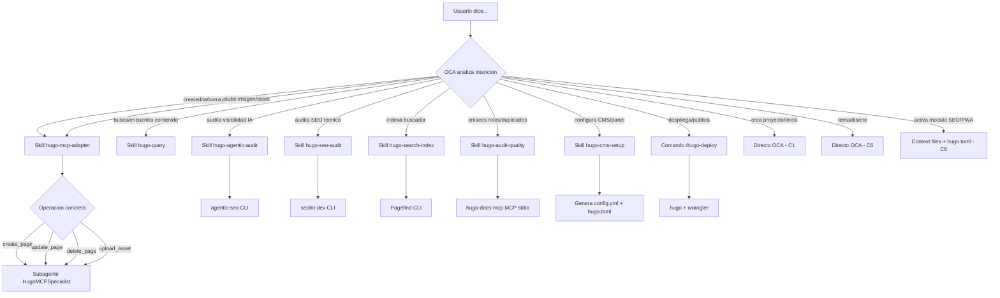

# Skills y comandos de OCA

**Proposito**: Catalogo de skills (comportamientos reutilizables) y comandos que OCA utiliza para gestionar sitios Hugo. Explica que hace cada skill, como invocarlo y como se relaciona con las capacidades del sistema.

**Fecha**: 2026-06-16

**Aplica a**: REPOC y REPON -- los skills se heredan al clonar el repositorio

---

## Indice

- [1. Que son los skills](#1-que-son-los-skills)
- [2. Catalogo de skills](#2-catalogo-de-skills)
- [3. Comando /hugo-deploy](#3-comando-hugo-deploy)
- [4. Como invocar cada skill](#4-como-invocar-cada-skill)
- [5. Subagentes](#5-subagentes)
- [6. Arbol de decision](#6-arbol-de-decision)
- [Ver tambien](#ver-tambien)

---

## 1. Que son los skills

Los skills son comportamientos reutilizables que OCA carga para saber como usar cada herramienta. Cada skill es un fichero Markdown en `.opencode/skills/<nombre>/SKILL.md` que contiene:

- **Descripcion**: que problema resuelve el skill.
- **Instrucciones**: pasos que OCA sigue cuando se activa el skill.
- **Dependencias**: herramientas, MCPs o entornos que necesita.
- **Ejemplos de invocacion**: frases del usuario que activan el skill.

Cuando el usuario expresa una intencion en lenguaje natural, OCA analiza la frase, selecciona el skill adecuado y lo ejecuta delegando en la herramienta correspondiente.

Los skills residen en REPOC y se heredan automaticamente al clonar el repositorio para crear un REPON. Esto significa que cualquier proyecto clonado de REPOC dispone de todas las capacidades sin configuracion adicional.

---

## 2. Catalogo de skills

| Skill | Funcion | Herramienta | Capacidad OCA |
|-------|---------|-------------|---------------|
| `hugo-mcp-adapter` | CRUD de paginas (crear, leer, actualizar, eliminar) y assets | hugo-mcp (jmrGrav) | C2 |
| `hugo-query` | Busqueda semantica FTS5 sobre el contenido del sitio | hugo-memex (queelius) | C3 |
| `hugo-search-index` | Indexar el sitio con Pagefind para busqueda de visitantes | Pagefind | C4 |
| `hugo-agentic-audit` | Auditoria de visibilidad en agentes IA (AEO) | agentic-seo (addyosmani) | C5 |
| `hugo-seo-audit` | Auditoria SEO tecnica con exportacion AI-Ready | seofor.dev | C5 |
| `hugo-audit-quality` | Auditoria de calidad del contenido (enlaces, frontmatter, duplicados) | hugo-docs-mcp (danfinn5) | C10 |
| `hugo-cms-setup` | Configurar CMS visual Decap CMS | Decap CMS (via HugoMods) | C7 |

### Detalle de cada skill

**hugo-mcp-adapter**

- Ubicacion: `.opencode/skills/hugo-mcp-adapter/SKILL.md`
- MCP server: `.opencode/mcp/hugo-mcp-src/` (Python, venv)
- Herramientas del MCP: `list_pages`, `get_page`, `create_page`, `update_page`, `delete_page`, `build_site`, `upload_asset`, `list_assets`, `generate_featured_image`, `check_sri_versions`
- Dependencias: Python 3.12+, venv con `pip install -r requirements.txt`

**hugo-query**

- Ubicacion: `.opencode/skills/hugo-query/SKILL.md`
- MCP server: `.opencode/mcp/hugo-memex-src/` (Python, venv)
- Capacidades: busqueda full-text, sugerencia de tags, validacion de contenido, consultas SQL sobre el indice FTS5
- Dependencias: Python 3.12+, venv con `pip install -e .`

**hugo-search-index**

- Ubicacion: `.opencode/skills/hugo-search-index/SKILL.md`
- Herramienta CLI: Pagefind (npm global)
- Ejecucion: post-build, tras cada `hugo --minify --gc`
- Dependencias: Node.js 18+, `npm install -g pagefind`

**hugo-agentic-audit**

- Ubicacion: `.opencode/skills/hugo-agentic-audit/SKILL.md`
- Herramienta CLI: agentic-seo (npm global)
- Auditorias: robots.txt, llms.txt, AGENTS.md, simulacion de crawlers ChatGPT/Claude/Gemini/Perplexity
- Dependencias: Node.js 18+, `npm install -g agentic-seo`

**hugo-seo-audit**

- Ubicacion: `.opencode/skills/hugo-seo-audit/SKILL.md`
- Herramienta CLI: seofor.dev (binario Go)
- Auditorias: meta tags, rendimiento, HTML semantico, enlaces rotos, IndexNow
- Dependencias: Go binary en `/usr/local/bin/seo`, Playwright browsers

**hugo-audit-quality**

- Ubicacion: `.opencode/skills/hugo-audit-quality/SKILL.md`
- MCP server: `.opencode/mcp/hugo-docs-mcp` (Go binary)
- Auditorias: frontmatter validation, link checking, duplicate detection, content freshness, scaffolding
- Dependencias: Go 1.21+, binario compilado en `.opencode/mcp/hugo-docs-mcp`

**hugo-cms-setup**

- Ubicacion: `.opencode/skills/hugo-cms-setup/SKILL.md`
- Herramienta: Decap CMS via HugoMods
- Acciones: genera `static/admin/config.yml`, configura tipos de contenido y autenticacion GitHub OAuth
- Dependencias: modulo HugoMods Decap CMS en `hugo.toml`, cuenta GitHub

---

## 3. Comando /hugo-deploy

El comando `/hugo-deploy` es un atajo para construir el sitio y desplegarlo en Cloudflare Pages en un solo paso.

### Sintaxis

```
/hugo-deploy [--project <nombre>] [--dry-run] [--skip-audit]
```

### Flags

| Flag | Descripcion |
|------|-------------|
| `--project <nombre>` | Nombre del proyecto en Cloudflare Pages (si no se detecta automaticamente) |
| `--dry-run` | Solo build, sin desplegar |
| `--skip-audit` | Omitir auditorias SEO/AEO pre-deploy |

### Flujo interno

1. Verificar que Hugo y Wrangler estan instalados.
2. Verificar que Wrangler esta autenticado (`wrangler whois`).
3. Ejecutar `hugo --minify --gc` (build de produccion).
4. Si Pagefind esta disponible, ejecutar `npx pagefind --source public`.
5. A menos que `--skip-audit` este activo, ejecutar agentic-seo y seofor.dev.
6. Ejecutar `wrangler pages deploy public/ --project-name=<nombre>`.
7. Confirmar la URL de despliegue al usuario.

### Primer uso

Si es la primera vez que se despliega el proyecto, OCA pregunta:

```
OCA: "Cual es el nombre del proyecto en Cloudflare Pages?"
Usuario: "mi-blog"
OCA: "El proyecto no existe. Quieres crearlo?"
Usuario: "Si"
OCA: "Ejecutando: wrangler pages project create --name mi-blog --production-branch main"
```

---

## 4. Como invocar cada skill

El usuario no necesita saber el nombre del skill. Basta con expresar la intencion en lenguaje natural. OCA mapea la frase al skill correspondiente.

| Frase del usuario | Skill que se activa |
|-------------------|---------------------|
| "Crea una pagina de contacto" | `hugo-mcp-adapter` |
| "Anade un articulo sobre Node.js" | `hugo-mcp-adapter` |
| "Edita la pagina de inicio" | `hugo-mcp-adapter` |
| "Elimina la pagina acerca-de" | `hugo-mcp-adapter` |
| "Sube esta imagen a /images/logo" | `hugo-mcp-adapter` |
| "Busca articulos sobre Node.js" | `hugo-query` |
| "Encuentra contenido relacionado con Hugo" | `hugo-query` |
| "Que tags tiene la pagina de contacto?" | `hugo-query` |
| "Quiero que el sitio tenga buscador" | `hugo-search-index` |
| "Indexa el contenido para busqueda" | `hugo-search-index` |
| "Audita la visibilidad IA del sitio" | `hugo-agentic-audit` |
| "Esta optimizado para ChatGPT?" | `hugo-agentic-audit` |
| "Audita el SEO antes de desplegar" | `hugo-seo-audit` |
| "Genera reporte SEO" | `hugo-seo-audit` |
| "Hay enlaces rotos en el sitio?" | `hugo-audit-quality` |
| "Verifica que el contenido esta completo" | `hugo-audit-quality` |
| "Detecta paginas duplicadas" | `hugo-audit-quality` |
| "Configura un CMS para el sitio" | `hugo-cms-setup` |
| "Quiero un panel de administracion" | `hugo-cms-setup` |

Si una frase coincide con varios skills, OCA pregunta al usuario para confirmar cual es su intencion.

---

## 5. Subagentes

Ademas de los skills, OCA dispone de subagentes especializados que delegan tareas complejas.

### HugoMCPSpecialist

Subagente delegado para operaciones de contenido via hugo-mcp. Se activa cuando el skill `hugo-mcp-adapter` necesita ejecutar comandos CRUD.

Flujo de delegacion:

```
Usuario → OCA → hugo-mcp-adapter (skill) → HugoMCPSpecialist (subagente) → hugo-mcp (MCP server) → Hugo SSG
```

El subagente conoce:

- La sintaxis exacta de cada herramienta de hugo-mcp.
- Como manejar errores de conexion del MCP server.
- Como reconstruir el sitio tras cada operacion.
- Como purgar Cloudflare si esta configurado.

### Otros subagentes

El sistema puede incorporar mas subagentes segun las necesidades del proyecto. Cada subagente reside en `.opencode/agent/subagents/` con su propia definicion y contexto.

---

## 6. Arbol de decision

Diagrama Mermaid que muestra como OCA mapea la intencion del usuario al skill correspondiente:



Reglas de decision:

1. OCA analiza el verbo principal de la frase del usuario.
2. Si el verbo coincide con una capacidad, selecciona el skill o comando correspondiente.
3. Si hay ambiguedad, OCA pregunta al usuario para confirmar.
4. Los skills que usan MCP (hugo-mcp-adapter, hugo-query, hugo-audit-quality) inician el MCP server en stdio antes de ejecutar.
5. Los skills que usan CLI (hugo-search-index, hugo-agentic-audit, hugo-seo-audit) ejecutan directamente la herramienta.
6. El comando `/hugo-deploy` integra varios pasos: build, indexacion, auditorias opcionales y deploy.

---

## Ver tambien

- [Calidad, SEO y busqueda en el sitio](06_calidad-seo-busqueda.md) -- Detalle de las herramientas de auditoria e indexacion.
- [Modulos HugoMods](03_modulos-hugomods.md) -- Modulos funcionales que complementan las capacidades de OCA.
- [CMS visual con Decap CMS](07_cms-decap.md) -- Configuracion del CMS visual (skill hugo-cms-setup).
- [Capacidades OCA para Hugo](../flujos/01_capacidades-oca-hugo.md) -- Catalogo completo de capacidades C1 a C10.
- [Inicio rapido -- De REPOC a primer sitio Hugo](01_inicio-rapido.md) -- Instalacion de herramientas y skills.
