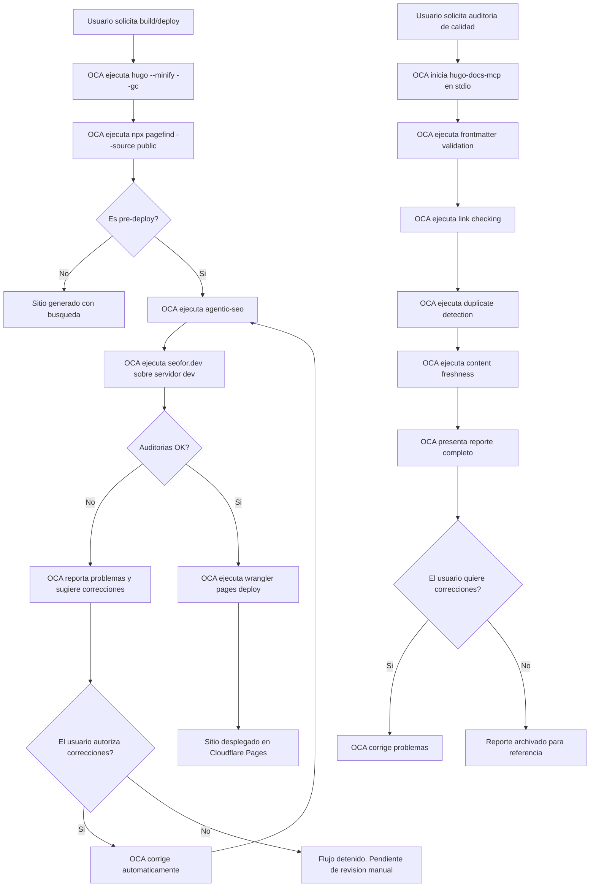

# Calidad, SEO y busqueda en el sitio

**Proposito**: Guia para auditar la calidad del contenido, optimizar el SEO tecnico y la visibilidad en agentes IA, e indexar la busqueda del sitio. Cubre las 4 herramientas de auditoria e indexacion del ecosistema REPOC.

**Fecha**: 2026-06-16

**Aplica a**: REPON con proyecto Hugo creado y desplegado

**Prerrequisito**: Herramientas instaladas segun [guia de inicio rapido](01_inicio-rapido.md).

---

## Indice

- [1. Vision general](#1-vision-general)
- [2. Indexar busqueda con Pagefind](#2-indexar-busqueda-con-pagefind)
- [3. Auditar visibilidad IA](#3-auditar-visibilidad-ia)
- [4. Auditar SEO tecnico](#4-auditar-seo-tecnico)
- [5. Auditar calidad del contenido](#5-auditar-calidad-del-contenido)
- [6. Frecuencia recomendada](#6-frecuencia-recomendada)
- [7. Diagrama Mermaid](#7-diagrama-mermaid)
- [Ver tambien](#ver-tambien)

---

## 1. Vision general

Cada herramienta cubre un aspecto distinto de la calidad y visibilidad del sitio:

| Herramienta | Que audita / indexa | Cuando se ejecuta | Para quien |
|-------------|---------------------|-------------------|------------|
| **Pagefind** | Busqueda full-text para visitantes del sitio (post-build) | Despues de cada build de produccion | Visitantes humanos del sitio |
| **agentic-seo** | Visibilidad en agentes IA: robots.txt, llms.txt, AGENTS.md, crawlers ChatGPT/Claude/Gemini | Pre-deploy o a peticion | Dueño del sitio (AEO) |
| **seofor.dev** | SEO tecnico: meta tags, rendimiento, IndexNow, HTML semantico | Pre-deploy o a peticion | Dueño del sitio (SEO) |
| **hugo-docs-mcp** | Calidad del contenido: enlaces rotos, frontmatter, duplicados, antiguedad | Semanal / mensual | Dueño del sitio (calidad) |

Relacion entre herramientas:

- Pagefind y hugo-memex (skill `hugo-query`) no compiten: Pagefind indexa para el visitante del sitio, hugo-memex indexa para OCA.
- agentic-seo y seofor.dev son complementarios: uno audita visibilidad en agentes IA, el otro audita SEO tecnico tradicional.
- HugoMods SEO genera los meta tags; seofor.dev verifica que sean correctos.

---

## 2. Indexar busqueda con Pagefind

Pagefind genera un indice de busqueda full-text a partir del HTML generado por Hugo. El resultado es un widget de busqueda (~10KB + WASM) que los visitantes usan en el navegador.

### Flujo de indexacion

OCA ejecuta automaticamente la indexacion despues de cada build de produccion:

```bash
hugo --minify --gc && npx pagefind --source public
```

El skill `hugo-search-index` se encarga de:

1. Ejecutar `hugo --minify --gc` para generar el sitio.
2. Ejecutar `npx pagefind --source public` para indexar el HTML.
3. Verificar que el directorio `public/pagefind/` se creo con `pagefind.js` y el bundle WASM.
4. Confirmar al usuario que la busqueda esta operativa.

### Opciones habituales

| Flag | Descripcion | Ejemplo |
|------|-------------|---------|
| `--source` | Directorio donde esta el HTML generado | `--source public` |
| `--bundle-dir` | Nombre del directorio de salida del indice | `--bundle-dir _pagefind` |
| `--glob` | Patron de archivos a incluir | `--glob "**/*.html"` |
| `--force-language` | Idioma forzado para sitios multilingue | `--force-language es` |

### Integracion en `/hugo-deploy`

El comando `/hugo-deploy` incluye la indexacion de Pagefind como paso intermedio entre el build y el deploy:

```
/hugo-deploy
  └─ hugo --minify --gc
  └─ npx pagefind --source public
  └─ wrangler pages deploy public/ --project-name=<nombre>
```

### Verificar el indice

Comprueba que el directorio existe tras la indexacion:

```bash
ls public/pagefind/pagefind.js
```

---

## 3. Auditar visibilidad IA

La auditoria de visibilidad en agentes IA (AEO, Agentic Engine Optimization) verifica que el sitio es interpretable por ChatGPT, Claude, Gemini y Perplexity.

### Herramienta: agentic-seo

Desarrollada por Addy Osmani (Google Chrome). Analiza robots.txt, llms.txt, AGENTS.md y simula crawlers de los principales agentes IA.

### Ejecucion

OCA ejecuta el skill `hugo-agentic-audit`:

```bash
agentic-seo https://ejemplo.com
```

O contra el servidor de desarrollo local:

```bash
agentic-seo http://localhost:1313
```

### Que audita

| Componente | Que verifica | Solucion si falla |
|------------|-------------|-------------------|
| robots.txt | Permite el acceso a agentes IA | Anadir reglas de allow en `static/robots.txt` |
| llms.txt | Proporciona resumen del sitio para LLMs | Crear `static/llms.txt` con indice del contenido |
| AGENTS.md | Define capacidades del sitio para agentes IA | Crear `static/AGENTS.md` con metadatos del sitio |
| Crawler ChatGPT | Simula como ChatGPT ve el sitio | Revisar contenido bloqueado por JS |
| Crawler Claude | Simula como Anthropic Claude ve el sitio | Revisar meta tags y contenido semantico |
| Crawler Gemini | Simula como Google Gemini ve el sitio | Verificar Schema.org y datos estructurados |
| Crawler Perplexity | Simula como Perplexity ve el sitio | Revisar que el contenido principal es accesible |

### Interpretar resultados

OCA presenta los resultados asi:

```
Auditoria AEO para https://ejemplo.com:
  robots.txt:   OK
  llms.txt:     NO ENCONTRADO (sugerencia: crear llms.txt)
  AGENTS.md:    OK
  ChatGPT:      OK
  Claude:       OK
  Gemini:       FALLOS (3) — meta tags OG ausentes
  Perplexity:   OK
```

OCA puede ejecutar las correcciones automaticamente si el usuario lo solicita.

---

## 4. Auditar SEO tecnico

La auditoria SEO tecnica con seofor.dev verifica meta tags, rendimiento, HTML semantico y estructura del sitio.

### Herramienta: seofor.dev

CLI-first con exportacion AI-Ready. Realiza crawling local del sitio y genera un reporte interpretable por OCA.

### Ejecucion

OCA ejecuta el skill `hugo-seo-audit`:

1. Arranca el servidor de desarrollo de Hugo:

```bash
hugo server -D --port 1313
```

2. En paralelo, ejecuta la auditoria:

```bash
seo audit run --port 1313
```

3. Una vez completada, OCA lee el reporte AI-Ready y presenta los hallazgos.

### Que audita

| Categoria | Que verifica | Ejemplo de fallo |
|-----------|-------------|-------------------|
| Meta tags | title, description, OG, Twitter Cards | Pagina sin meta description |
| Rendimiento | Tiempo de carga, Core Web Vitals | LCP superior a 2.5s |
| HTML semantico | Uso correcto de h1-h6, landmarks | Varios h1 en la misma pagina |
| Enlaces rotos | Links internos y externos | Enlace a pagina 404 |
| IndexNow | Envio de URL a buscadores | URL no enviada tras cambios |

### Reporte AI-Ready

seofor.dev genera un reporte en formato estructurado que OCA interpreta:

```json
{
  "url": "http://localhost:1313",
  "timestamp": "2026-06-16T10:00:00Z",
  "issues": {
    "critical": [],
    "warnings": [
      {"type": "missing_meta", "page": "/blog/", "field": "description"},
      {"type": "multiple_h1", "page": "/", "count": 2}
    ],
    "info": []
  },
  "score": 85
}
```

### IndexNow

Tras desplegar contenido nuevo, OCA puede enviar las URL a los buscadores:

```bash
seo index submit https://ejemplo.com/nueva-pagina
```

---

## 5. Auditar calidad del contenido

La auditoria de calidad verifica la salud del contenido: enlaces, frontmatter, duplicados y antiguedad.

### Herramienta: hugo-docs-mcp

MCP server de danfinn5 escrito en Go. Se ejecuta en modo stdio. OCA lo invoca a traves del skill `hugo-audit-quality`.

### Ejecucion

OCA inicia el MCP server y ejecuta las auditorias:

```bash
.opencode/mcp/hugo-docs-mcp
```

### Auditorias disponibles

| Auditoria | Descripcion | Comprueba |
|-----------|-------------|-----------|
| Frontmatter | Validacion de campos obligatorios | Que todas las paginas tienen title, date, description |
| Enlaces | Deteccion de enlaces internos y externos rotos | Links que devuelven 404 |
| Duplicados | Deteccion de contenido duplicado o casi duplicado | Paginas con mismo titulo o contenido similar |
| Antiguedad | Paginas no actualizadas en mas de N dias | Contenido obsoleto que necesita revision |
| Scaffolding | Generacion de esqueleto para secciones faltantes | Secciones del sitio que no existen |

### Ejemplo de resultados

OCA presenta un resumen accionable:

```
Auditoria de calidad:
  Frontmatter:   3 paginas sin description (blog/articulo-1.md, blog/articulo-2.md, pages/legal.md)
  Enlaces rotos: 1 interno (blog/antiguo.md → /ruta-eliminada)
  Duplicados:    Ninguno
  Antiguedad:    2 paginas sin actualizar desde 2025 (pages/acerca.md, pages/faq.md)
```

OCA puede corregir los problemas detectados si el usuario lo autoriza.

---

## 6. Frecuencia recomendada

| Herramienta | Frecuencia | Disparador | Automatizado |
|-------------|------------|------------|--------------|
| Pagefind | Cada build de produccion | Post-build en `/hugo-deploy` | Si |
| agentic-seo | Pre-deploy (antes de desplegar cambios) | Manual o integrado en flujo pre-deploy | Recomendado |
| seofor.dev | Pre-deploy (antes de desplegar cambios) | Manual o integrado en flujo pre-deploy | Recomendado |
| hugo-docs-mcp | Semanal o mensual | A peticion del usuario o programado | Bajo demanda |

El flujo recomendado para cada despliegue es:

1. Build del sitio (incluye Pagefind).
2. Auditoria AEO con agentic-seo.
3. Auditoria SEO con seofor.dev.
4. Si todo es correcto, desplegar.

La auditoria de calidad con hugo-docs-mcp se ejecuta de forma independiente, con frecuencia semanal o mensual.

---

## 7. Diagrama Mermaid

Flujo de calidad completo desde el build hasta el despliegue:



Flujo resumido de calidad para despliegue:

1. Build del sitio Hugo.
2. Indexacion con Pagefind (busqueda para visitantes).
3. Auditoria AEO con agentic-seo.
4. Auditoria SEO con seofor.dev.
5. Si todo OK, deploy con wrangler.
6. Auditoria de calidad con hugo-docs-mcp como proceso independiente (semanal/mensual).

---

## Ver tambien

- [Skills y comandos de OCA](05_skills-comandos.md) -- Catalogo de skills que ejecutan las auditorias.
- [Modulos HugoMods](03_modulos-hugomods.md) -- Modulo SEO que genera meta tags (complementario a las auditorias).
- [Gestion de contenido con OCA](04_gestion-contenido.md) -- Busqueda de contenido con hugo-memex (complementario a Pagefind).
- [Inicio rapido -- De REPOC a primer sitio Hugo](01_inicio-rapido.md) -- Instalacion de herramientas.
- [Capacidades OCA para Hugo](../flujos/01_capacidades-oca-hugo.md) -- Capacidades C4, C5 y C10 relacionadas.
