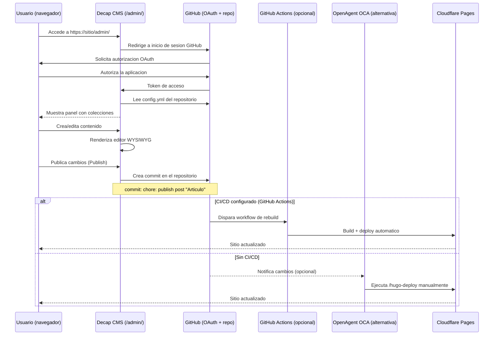

# CMS visual con Decap CMS

**Proposito**: Guia para configurar un panel de administracion visual (CMS) en el sitio Hugo usando Decap CMS. Permite crear y editar contenido desde el navegador sin necesidad de escribir Markdown ni usar Git directamente.

**Fecha**: 2026-06-16

**Aplica a**: REPON desplegado en GitHub y Cloudflare Pages

**Prerrequisito**: 
- Proyecto Hugo creado segun [guia de creacion de proyectos](02_crear-proyecto.md).
- Repositorio en GitHub (requisito de autenticacion de Decap CMS).
- Sitio desplegado en produccion (el CMS no funciona en localhost).

---

## Indice

- [1. Que es Decap CMS](#1-que-es-decap-cms)
- [2. Requisitos](#2-requisitos)
- [3. Configurar el modulo](#3-configurar-el-modulo)
- [4. Generar config.yml](#4-generar-configyml)
- [5. Configurar OAuth de GitHub](#5-configurar-oauth-de-github)
- [6. Acceder al CMS](#6-acceder-al-cms)
- [7. Limitaciones](#7-limitaciones)
- [8. Diagrama Mermaid](#8-diagrama-mermaid)
- [Ver tambien](#ver-tambien)

---

## 1. Que es Decap CMS

Decap CMS (anteriormente Netlify CMS) es un CMS Git-based de codigo abierto. Proporciona una interfaz WYSIWYG en el navegador para gestionar el contenido del sitio.

### Como funciona

1. El usuario accede a `https://<sitio>/admin/`.
2. Inicia sesion con su cuenta de GitHub.
3. Crea o edita contenido en el editor visual.
4. Decap CMS genera un commit en el repositorio GitHub.
5. GitHub activa el rebuild del sitio (o OCA lo hace manualmente).
6. Los cambios aparecen en el sitio desplegado.

### Ventajas

- No requiere escribir Markdown.
- No requiere usar Git directamente.
- Los cambios quedan versionados en GitHub.
- Interfaz familiar: editor de texto enriquecido, selector de imagenes, campos estructurados.

### Diferencia con OCA

| Canal | Como se usa | Ideal para |
|-------|-------------|------------|
| OCA (chat) | Lenguaje natural: "crea una pagina de contacto" | Creacion rapida, ediciones por voz/texto, automatizaciones |
| Decap CMS (web) | Interfaz visual en el navegador | Usuarios no tecnicos, edicion visual, equipo editorial |

Ambos canales son complementarios. OCA gestiona el contenido desde el chat; Decap CMS desde la web.

---

## 2. Requisitos

Antes de comenzar, verifica que cumples estos requisitos:

| Requisito | Detalle | Como verificarlo |
|-----------|---------|------------------|
| Cuenta GitHub | Necesaria para autenticacion OAuth | `gh auth status` |
| Repositorio GitHub del sitio | El sitio debe estar en un repo GitHub | `git remote -v` |
| Sitio desplegado | El CMS solo funciona en produccion | Visitar `https://<sitio>/` |
| Modulo Decap CMS | Activado en `hugo.toml` | Ver seccion 3 de esta guia |

---

## 3. Configurar el modulo

Decap CMS se activa como un modulo HugoMods. OCA anade el import en `hugo.toml`:

```toml
[[module.imports]]
path = "github.com/hugomods/decap-cms"
```

Para activarlo, el usuario dice a OCA:

> "Quiero un CMS para editar contenido"
> "Configura Decap CMS"
> "Anade un panel de administracion"

OCA ejecuta el skill `hugo-cms-setup`, que:

1. Pregunta al usuario que tipos de contenido necesita (posts, pages, etc.).
2. Anade el modulo Decap CMS en `hugo.toml`.
3. Genera el fichero `static/admin/config.yml` con las colecciones.
4. Guia al usuario en la configuracion de OAuth de GitHub.
5. Verifica que el CMS carga correctamente en `https://<sitio>/admin/`.

---

## 4. Generar config.yml

El fichero `static/admin/config.yml` define la configuracion del CMS: backend, colecciones, campos y media.

OCA genera este fichero preguntando al usuario una cosa a la vez:

| Pregunta de OCA | Ejemplo de respuesta |
|-----------------|----------------------|
| "Que tipos de contenido quieres gestionar?" | "Posts y paginas" |
| "En que directorio estan los posts?" | "content/blog" |
| "Que campos tiene cada post?" | "titulo, fecha, tags, cuerpo" |
| "Cual es el repositorio de GitHub?" | "usuario/mi-blog" |

### Ejemplo de config.yml generado

```yaml
backend:
  name: github
  repo: usuario/mi-blog
  branch: main
  base_url: https://api.github.com

media_folder: "static/images"
public_folder: "/images"

collections:
  - name: "posts"
    label: "Posts"
    folder: "content/blog"
    create: true
    slug: "{{slug}}"
    fields:
      - { label: "Titulo", name: "title", widget: "string" }
      - { label: "Fecha", name: "date", widget: "datetime" }
      - { label: "Borrador", name: "draft", widget: "boolean", default: true }
      - { label: "Tags", name: "tags", widget: "list", required: false }
      - { label: "Descripcion", name: "description", widget: "text", required: false }
      - { label: "Contenido", name: "body", widget: "markdown" }

  - name: "pages"
    label: "Paginas"
    folder: "content/pages"
    create: true
    slug: "{{slug}}"
    fields:
      - { label: "Titulo", name: "title", widget: "string" }
      - { label: "Fecha", name: "date", widget: "datetime" }
      - { label: "Contenido", name: "body", widget: "markdown" }
```

### Campos del config.yml

| Campo | Descripcion | Valor tipico |
|-------|-------------|--------------|
| `backend.name` | Proveedor de autenticacion | `github` |
| `backend.repo` | Repositorio del sitio | `usuario/mi-blog` |
| `backend.branch` | Rama de publicacion | `main` |
| `media_folder` | Directorio de imagenes en el repo | `static/images` |
| `public_folder` | Ruta publica de las imagenes | `/images` |
| `collections` | Lista de tipos de contenido | Posts, paginas, etc. |

---

## 5. Configurar OAuth de GitHub

Decap CMS necesita autenticacion OAuth de GitHub para poder hacer commits en el repositorio. Este paso lo realiza el usuario en la interfaz de GitHub.

### Pasos

1. Ir a GitHub Settings > Developer settings > OAuth Apps > New OAuth App.

2. Rellenar el formulario:

| Campo | Valor |
|-------|-------|
| Application name | `Decap CMS - <nombre-del-sitio>` |
| Homepage URL | `https://<sitio>/` |
| Authorization callback URL | `https://api.netlify.com/auth/done` |

La URL de callback `https://api.netlify.com/auth/done` es la que utiliza Decap CMS para el flujo OAuth. No es necesario tener cuenta en Netlify.

3. Hacer clic en "Register application".

4. Copiar el Client ID y generar un Client Secret.

5. OCA puede preguntar si el usuario quiere guardar estas credenciales en el repositorio como variables de entorno (por ejemplo, en GitHub Actions si se usa).

### Nota importante

La autenticacion OAuth es necesaria para que Decap CMS pueda escribir en el repositorio. Sin este paso, el CMS permite navegar pero no guardar cambios.

---

## 6. Acceder al CMS

Una vez configurado, el CMS esta disponible en:

```
https://<sitio>/admin/
```

### Flujo de acceso

1. El usuario navega a `https://<sitio>/admin/`.
2. Decap CMS redirige a GitHub para iniciar sesion (OAuth).
3. El usuario autoriza la aplicacion.
4. El CMS carga el panel con las colecciones configuradas.
5. El usuario puede crear, editar, borrar y publicar contenido.

### Primera publicacion con CMS

1. Crear un post desde el panel.
2. Hacer clic en "Publish".
3. Decap CMS genera un commit en el repositorio: `chore: publish post "Mi articulo"`.
4. Si el sitio tiene GitHub Actions configurado, el rebuild se activa automaticamente.
5. Si no, OCA o el usuario deben ejecutar `/hugo-deploy` manualmente.

---

## 7. Limitaciones

| Limitacion | Detalle | Alternativa |
|------------|---------|-------------|
| Solo en produccion | Decap CMS no funciona en localhost por la redireccion OAuth | Usar OCA para editar en local |
| Requiere autenticacion GitHub | Todos los editores necesitan cuenta GitHub | Invitar como colaboradores al repo |
| Sin preview en tiempo real | El CMS muestra una previsualizacion aproximada, no el diseno final | Usar `hugo server -D` para previsualizar |
| Dependencia de GitHub | Si GitHub no esta disponible, el CMS no funciona | Los ficheros Markdown siguen siendo editables localmente |
| Configuracion unica por repo | El `config.yml` se comparte entre todos los editores | Los cambios de configuracion los hace OCA |

### Soluciones a limitaciones comunes

**El CMS no carga en localhost**: Es esperado. Decap CMS requiere una URL publica para el flujo OAuth. Usa el sitio desplegado o un tunel como ngrok.

**Error "No auth endpoint configured"**: La URL de callback de la OAuth App debe ser exactamente `https://api.netlify.com/auth/done`. Verifica este valor en GitHub.

**Los cambios no se ven tras publicar**: El CMS solo hace commit. El rebuild depende de la configuracion del repositorio. Si no hay CI/CD, ejecuta `/hugo-deploy` tras publicar.

---

## 8. Diagrama Mermaid

Flujo completo: desde que el usuario accede al CMS hasta que el sitio se actualiza:



Pasos del flujo:

1. El usuario accede a `/admin/` e inicia sesion con GitHub.
2. Decap CMS carga la configuracion y las colecciones desde el repositorio.
3. El usuario crea o edita contenido en el editor visual.
4. Al publicar, Decap CMS hace commit directo al repositorio GitHub.
5. Si hay CI/CD (GitHub Actions), el sitio se reconstruye y despliega automaticamente.
6. Si no hay CI/CD, OCA ejecuta `/hugo-deploy` para actualizar el sitio.

---

## Ver tambien

- [Skills y comandos de OCA](05_skills-comandos.md) -- Skill `hugo-cms-setup` que automatiza la configuracion del CMS.
- [Modulos HugoMods](03_modulos-hugomods.md) -- Modulo Decap CMS como parte del ecosistema HugoMods.
- [Gestion de contenido con OCA](04_gestion-contenido.md) -- Alternativa por chat para gestionar contenido.
- [Calidad, SEO y busqueda en el sitio](06_calidad-seo-busqueda.md) -- Auditorias recomendadas antes de desplegar contenido publicado via CMS.
- [Capacidades OCA para Hugo](../flujos/01_capacidades-oca-hugo.md) -- Capacidad C7: configurar CMS visual.
